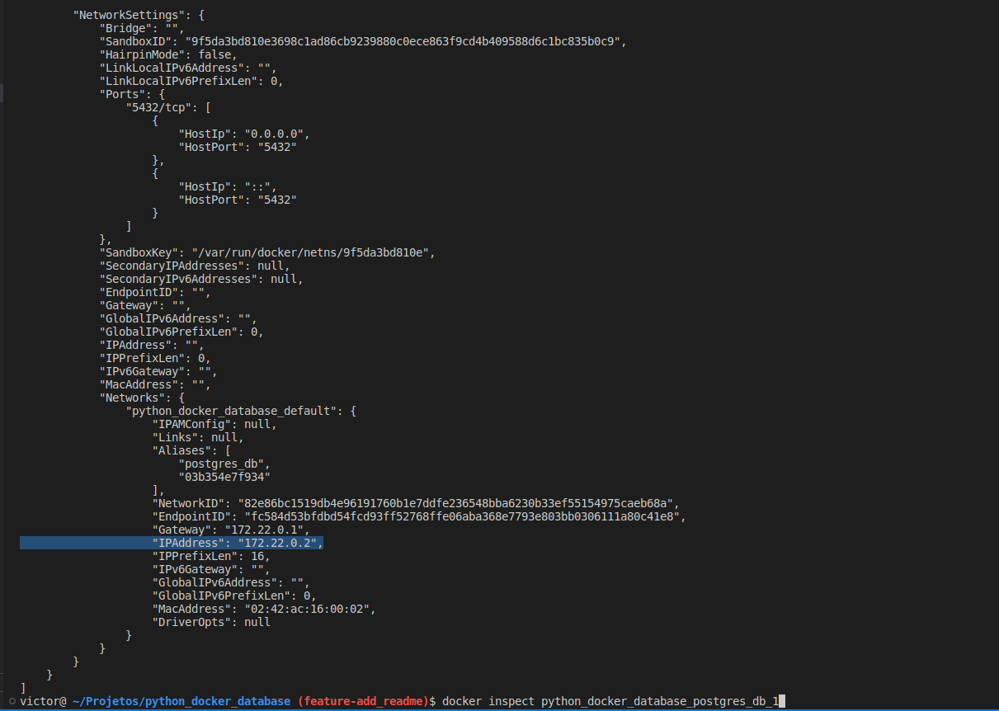

# Python Docker Database
## Pequena demonstração de como utilizar o docker-compose para agilizar a integração do python com banco de dados

# Como rodar
* __1. Configurando as variáveis de ambiente__
    - 1.1: Use as chaves disponíveis em .env_sample para criar o seu arquivo .env, contendo as suas variáveis de ambiente. Note que, o arquivo deve se chamar .env, devido ao modo como está definido no docker-compose.

* __2. Buildando e levando os containers__
    - 2.1: Para buildar a imagem, execute:
        - docker-compose up --build
    - Note que, ao fazer isto, será baixado as imagens do postgres e do python, nas versões indicadas no docker-compose.yaml e Dockerfile respectivamente, caso você não as tenha no seu docker.
    - Após isto, o banco de dados estará disponível.

* __3. Acessando o banco de dados__
    - 3.1 Usando o db manager beekeeper.
    - Os valores de user, password e default database, devem ser os mesmos valores presentes em seu arquivo .env.
    - Para conseguir o endereço de host, use 0.0.0.0, ou então abra um outro terminal (uma vez que haja um terminal em execução para o docker levantando o banco de dados), e execute:
    - docker inspect python_docker_database_postgres_db_1, e procure por IPAddress.

- Acessando o banco através do beekeeper:

- Obtendo o host:

